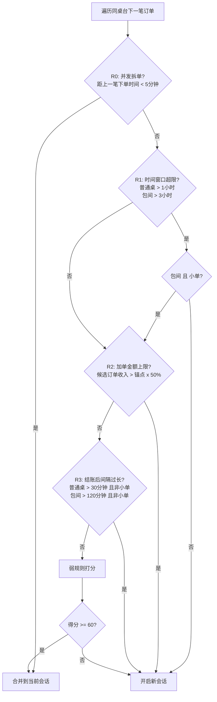

# 订单合并逻辑优化方案

## 问题分析

通过实际数据验证，当前合并算法存在两个核心缺陷导致频繁错误合并：

**缺陷1：没有"加单金额上限"硬约束**

以4/6大厅A区A10为例，当前把3笔独立午餐合并为一个团体：
- 订单004: 11:50 结账12:47, **¥435** (干烧鱼+牛肉丝, 2人)
- 订单024: 12:51 结账13:28, **¥447** (牛蛙+春笋, 2人) -- 447/435 = **103%**
- 订单037: 13:34 结账14:39, **¥322** (水煮牛肉+椒麻鸡, 2人) -- 322/447 = **72%**

这三笔金额相当、菜品完全不同的"完整餐"被合并，原因是弱规则打分轻松达标：基础分(20) + 结账后15分钟内(25) + 人数一致(15) = 60分，恰好到阈值。**缺少金额比例的硬性拦截。**

**缺陷2：普通桌台3小时时间窗口过长**

大厅桌台翻台很快（午餐高峰期间隔仅10-40分钟），但3小时窗口把大量翻台订单纳入了合并候选。以4/5数据为例：
- A05桌一天6笔订单全在3小时窗口内可能被串联合并
- A06桌一天5笔订单，午餐连续4笔间隔均在30-50分钟

**数据还揭示了一个必须处理的场景：并发拆单**

4/4 大厅B区B01-1：订单700018 (12:39:06, ¥167) 和 700019 (12:39:37, ¥219) 仅相隔31秒，是两人同桌各自扫码下单。当前系统恰好正确合并了这对，但新的50%规则（219/167=131%）会误拦它们，因此需要增加"并发下单"识别规则。

---

## 新规则体系设计

新的合并逻辑按优先级从高到低依次判定，**第一个命中的规则即做出最终决策**：

### 各规则详细说明

**R0: 并发拆单识别（新增硬规则 -- 强制合并）**
- 条件：候选订单下单时间 - 当前会话中最后一笔订单的下单时间 < 5分钟
- 决策：**直接合并**，跳过所有后续规则
- 场景：多人同桌各自扫码同时下单，金额可能都很大
- 数据验证：4/4 B01-1 的 12:39:06 和 12:39:37 订单（相隔31秒）正确合并

**R1: 时间窗口（调整参数）**
- 普通桌台（桌台名不含"包间"）：候选下单时间 - 会话开始时间 > **1小时** --> 新会话
- 包间：候选下单时间 - 会话开始时间 > **3小时** --> 新会话
- **例外**：包间的小单（收入 <= 锚点30% 或 商品行数 <= 2）可突破3小时限制（保留现有逻辑）
- 数据验证：4/6 A10 的订单055（17:04 vs 会话开始15:40 = 84分钟 > 60分钟）被正确拦截

**R2: 加单金额上限（新增硬规则 -- 核心改进）**
- 条件：候选订单收入 > 锚点订单收入 x **50%**
- 决策：**新会话**（金额太大，不是加单）
- 数据验证：
  - 4/6 A10: ¥447 vs ¥435 → 103% > 50% --> 拦截
  - 4/6 A10: ¥322 vs ¥447 → 72% > 50% --> 拦截
  - 4/4 包间3: ¥15 vs ¥1680 → 0.9% < 50% --> 放行（正确，这是真加单）

**R3: 结账后间隔翻台判定（调整参数）**
- 普通桌台：结账后间隔 > **30分钟** 且非小单 --> 新会话
- 包间：结账后间隔 > **120分钟** 且非小单 --> 新会话
- "小单"定义：收入 <= 锚点 x 30% **或** 商品行数 <= 2
- 作用：拦截通过了R2（< 50%）但仍然可疑的中等订单（30%-50%区间）

**弱规则打分（保留现有框架，微调）**
- 通过全部强规则的候选订单（必然 < 50%且在时间窗口内），进入打分：
  - 基础分：20（同桌且在窗口内）
  - 时间接近（结账后 <= 15分钟）：+25
  - 时间接近（结账后 15-30分钟）：+10
  - 会员手机号一致：+25 / 不一致：-10
  - 就餐人数相近（差 <= 1）：+15 / 差 >= 3：-15
  - 支付方式重叠：+5
  - 菜品Jaccard >= 0.1：+10
  - 小单金额分段加分：< 40元 +55 / 40-60元 +30 / > 60元 +15
  - 备注一致：+5
- 阈值：>= 60分合并

---

## 参数变更对照表

| 参数 | 旧值 | 新值 | 说明 |
|------|------|------|------|
| T_WINDOW_HOURS | 3（所有桌台） | - | 拆分为两个参数 |
| T_WINDOW_HOURS_REGULAR | (无) | **1** | 普通桌台时间窗口 |
| T_WINDOW_HOURS_PRIVATE | (无) | **3** | 包间时间窗口（不变） |
| ADD_ON_MAX_RATIO | (无) | **0.50** | 新增：加单金额上限 |
| CONCURRENT_MINUTES | (无) | **5** | 新增：并发拆单识别窗口 |
| T_REOPEN_MIN | 60 | - | 拆分为两个参数 |
| T_REOPEN_MIN_REGULAR | (无) | **30** | 普通桌台结账后间隔 |
| T_REOPEN_MIN_PRIVATE | 150 | **120** | 包间结账后间隔 |

---

## 需要修改的文件

1. **[config.py](order_merger_skill/config.py)**：更新参数定义
2. **[order_merger.py](order_merger_skill/order_merger.py)**：重写 `merge_orders` 函数的规则判定流程

---

## 用实际数据验证预期效果

**4/6 大厅A区A10（当前错误：3单合并为1组）**
- 004(¥435) -> 024(¥447): R1拦截(61分>60分), 即使不拦截R2也拦截(103%>50%) --> 分开 (correct)
- 024(¥447) -> 037(¥322): R2拦截(72%>50%) --> 分开 (correct)

**4/6 大厅A区A10 下午场（当前错误：3单合并为1组）**
- 051(¥462) -> 055(¥215): R1拦截(84分>60分) --> 分开 (correct)

**4/4 大厅B区B01-1 并发下单（当前正确：已合并）**
- 018(¥167) -> 019(¥219): R0命中(31秒<5分钟) --> 合并 (correct)

**4/4 包间包间3 真实加单（当前正确：已合并）**
- 006(¥1680) -> 035(¥15): R1(3h10m>3h但包间小单例外) --> R2(0.9%<50%) --> 合并 (correct)

**4/4 大厅B区B01-1 错误合并（当前错误：2组合并为1组）**
- 040(¥351) -> 051(¥310): R1拦截(77分>60分), R2也拦截(88%>50%) --> 分开 (correct)
